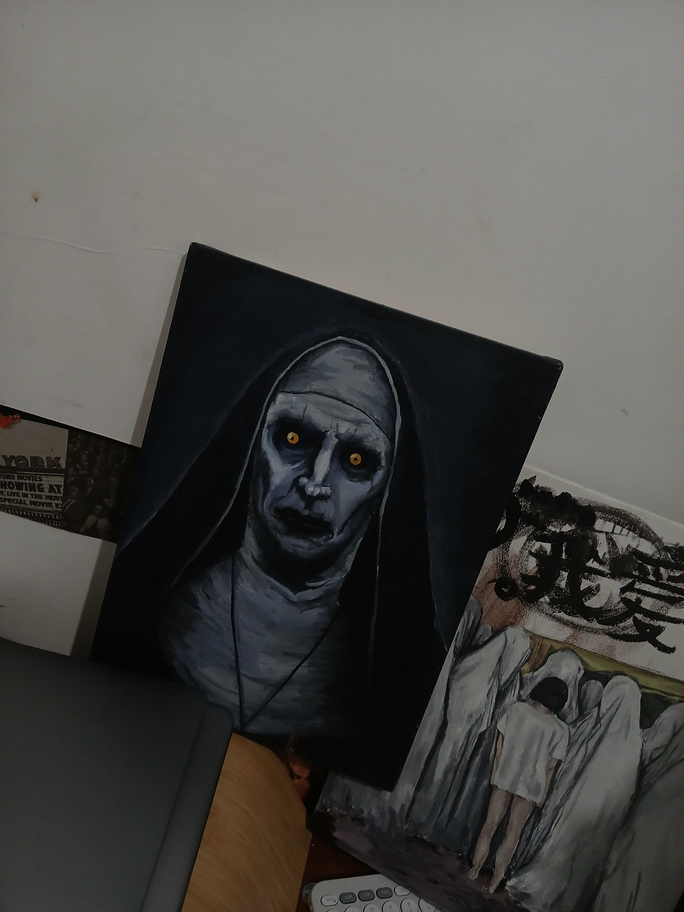

<h1 align="center">👋 Hi, I'm Wanziee</h1>

  A creative developer crafting slick interfaces and fun ideas 

  <a href="https://wanzie.vercel.app" target="_blank"><strong>🌐 My Portfolio →</strong></a>

 
Welcome to my corner of GitHub — where clean code meets creative chaos.  
By day, I craft digital experiences. By night... still coding — sometimes with a paintbrush in hand and music on full blast.

## 🚀 Tech & Tools

- **Languages:** TypeScript, JavaScript, PHP, Swift. 
- **Frameworks:** React, Laravel, SwiftUI.
- **Database:** MySQL  
- **Tools:** Git, GitHub, Postman. 

 

## 🎨 Hobbies

When I’m not debugging, I’m sketching or painting.  
Creating things — whether it’s a UI or a moody landscape — is my jam. Bonus if it impresses my cat. 🐱

 

## 🔒 Coming Soon

- **🎮 Gameload:** A fast and stylish game top-up site  
- **🧠 Quizie:** A Swift-built quiz app that makes trivia fun and clean

 

## 🎭 Behind the Scenes

Meet the real MVP of my creative space:

> **"Cutest girl in ma room"** — She silently judges your commit messages, especially if you skip unit tests or forget semicolons.

 

Thanks for dropping by — explore my repos, check the site, or just vibe.  
You’re always welcome here 🚀
