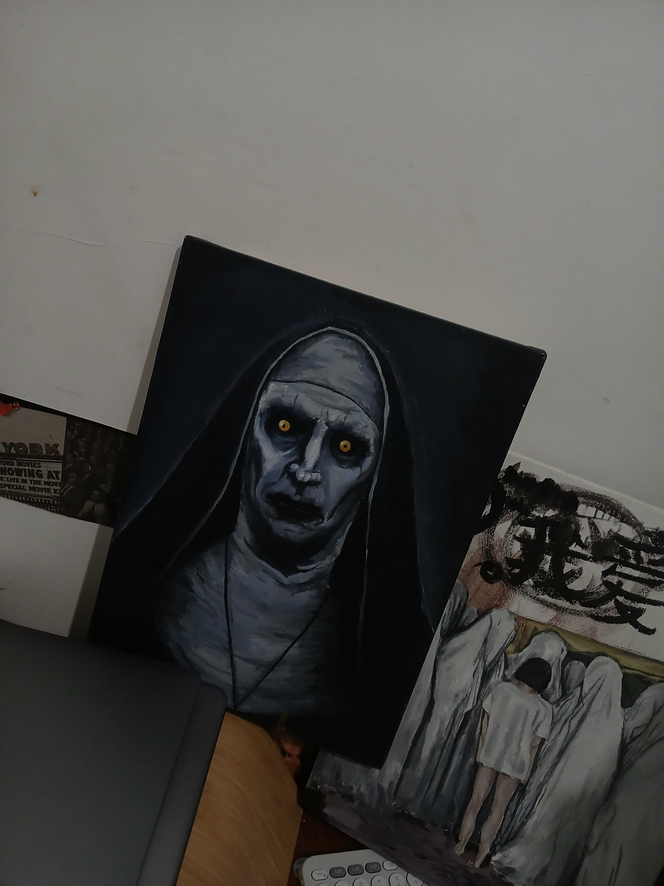

# Hi, I'm Wanzie! 👋

Welcome to my GitHub profile, where the magic of code meets the canvas of creativity. I'm a passionate developer by day and an artist by night (or, let's be honest, sometimes both at the same time).

## 🚀 Technologies & Skills

<ul>
  <li><strong>Languages:</strong> TypeScript, JavaScript, PHP, Swift — because I like my code as diverse as my coffee orders ☕.</li>
  <li><strong>Frameworks:</strong> React, Laravel, SwiftUI — From building beautiful apps with React to crafting elegant interfaces in SwiftUI, I’ve got you covered! 🚀</li>
  <li><strong>Databases:</strong> MySQL — I don't just store data, I give it a cozy home 🏠.</li>
  <li><strong>Tools:</strong> Git, GitHub, Docker — If you can't find me, check the terminal. I’m probably there, typing commands that make no sense to anyone else 💻.</li>
</ul>

## 🎨 Hobbies

When I’m not writing code, you can find me with a paintbrush in one hand and a sketchpad in the other. I believe in creativity — whether it's creating beautiful web apps or turning a blank canvas into something that might even impress my cat 🐱. 

## 🌐 Portfolio

Check out my portfolio to see my work in action (and yes, it's hosted with love):  
<a href="https://wanzie.vercel.app" target="_blank" rel="noopener noreferrer">My Portfolio</a>

## 🔒 Private Projects (Shhh, They're Not Public... Yet)

1. **Gameload** - A website for game top-up, where gamers can recharge their accounts in style. Think of it as a convenience store, but for pixels and power-ups! 🎮💸
   
2. **Quizie** - An app I built in Swift to create quizzes on the go. It’s like having your very own trivia master in your pocket — without the annoying voice. 🧠💡

---

And now, presenting the cuttest girl in my room. She's got attitude, she’s got style, and she's definitely the reason your code might suddenly compile without errors (or not... but we can pretend). 

**Fun fact:** She only shows up when you’ve been slacking on your commits. She's here to haunt your pull requests and steal your debugging snacks. 💅💻

---
